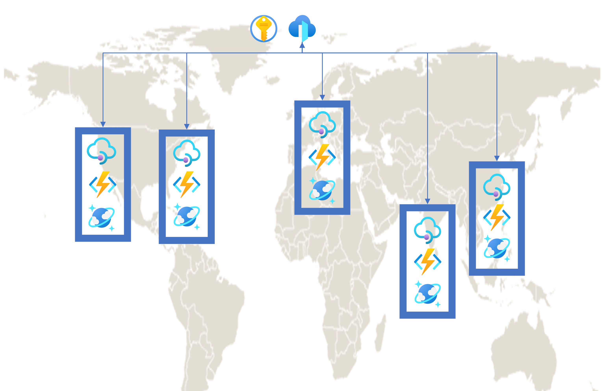

# Geode Pattern Accelerator

The accelerator is designed to help developers with Azure Functions based APIs that utilize Cosmos DB as a data store to implement the geode pattern by deploying their API to geodes in distributed Azure regions.



The repository contains Terraform code that deploys geodes to a configurable set of Azure regions, each containing an Azure Function App and API Management instance that fronts it. It also deploys a Cosmos DB account with read/write regions in each of the geode locations and an Azure Front Door that load balances between the regional API deployments. Each piece of the larger architecture is deployed with dedicated monitoring resources and security measures.

The accelerator can be used with any Azure Functions based API, but also supplies a basic .NET Inventory API as a starting place for new projects.

## Architecture Details

Applying the files in the terraform directory creates a series of resources in a new resource group. In each of the locations supplied via Terraform parameter, the code creates a Consumption tier API Management instance with an Azure Functions backend. The API Management instance has an API and Operations that exactly match the endpoints exposed by the Azure Function App. An Azure Front Door instance is deployed globally and is configured with backend pools and routing rules that allow it to distribute traffic between the API Management instances. The Front Door serves as the single point of entry for the API.

Each geode also receives a dedicated Azure AD application that is used to secure the geode's Function App. The API Management instance is deployed with Managed Identity and contains an `authentication-managed-identity` policy that allows it to call the Azure Functions. Traffic to the Azure Functions is thus restricted to the API Management instance in its geode. Each API Management instance is also secured so that the only entity capable of making requests is the Azure Front Door. Relevant secrets are stored in a single Key Vault instance which supports the entire resource group.

The Terraform code also creates a Cosmos DB instance with a database and containers that are necessary for the Azure Functions. Each of the locations supplied via Terraform parameter are added as read regions. Optionally, the files can be applied with multi-region write enabled, deploying each of the same read regions with write capabilities. Other important properties on the Cosmos DB like maximum throughput on the database and containers, consistency level, etc. can also be easily supplied via Terraform parameter. Traffic is restricted so that the only entities able to run Cosmos DB queries are the set of Azure Functions in the various geodes.

Monitoring resources are deployed to each of the resources in the larger API architecture, where possible. A single Log Analytics workspace is deployed to the resource group and is configured to capture logs from both the Front Door and Cosmos DB. Each Azure Function App is deployed with a dedicated Application Insights that is used to collect and query its log, performance, and error data. Application Insights significantly reduces throughput when applied to an API Management instance and the Consumption tier does not currently support Log Analytics, so monitoring has been omitted for API Management.

The top level resources deployed to the resource group _once_ are as follows:

- Front Door
- Cosmos DB
- Key Vault
- Log Analytics

The top level resources deployed _to each geode_ are as follows:

- API Management
- App Service Plan
- Azure Functions
- Azure Active Directory
- Application Insights
- Storage Account

## Use With Example Inventory API

The [/src](./src) directory contains a basic API that serves as an example and starting place for developers to get started with the accelerator. The Inventory API is designed to work with a Cosmos DB instance with an Inventory database and Products container. The API contains two endpoints, GetProducts and GetProductById, which retrieve all Products and a specific Product, respectively, from the Products container. The endpoints themselves utilize Cosmos DB input bindings for Azure Functions and simply return the retrieved result, without any additional C# logic. The endpoints are accessible through `https://<BASENAME><REGION>.azurewebsites.net/api/products` and `https://<BASENAME><REGION>.azurewebsites.net/api/product/{id}`.

Navigate to the [/terraform](./terraform) directory and initialize the project:

```dotnetcli
terraform init
```

Plan, and then apply the execution plan, supplying the appropriate values for your needs for each parameter:

```dotnetcli
terraform apply -var 'baseName=xxxxx' -var 'primaryLocation=xxxxx' -var 'additionalLocations=[\"xxxxx\"]' -var 'appServicePlanTier=xxxxx' -var 'appServicePlanSize=xxxxx' -var 'databaseMaxThroughput=xxxxx' -var 'containerMaxThroughput=xxxxx' -var 'consistencyLevel=xxxxx' -var 'availabilityZones=xxxxx' -var 'multiRegionWrite=xxxxx'
```

Finally, navigate to the [/terraform/scripts](./terraform/scripts) directory and run publishfunctions.sh, passing in the language the Function App is written in and the relative paths for the directories that contain the Terraform and Azure Functions projects. The shell script ingests the outputs from the `terraform apply` and deploys the API code to each Azure Function App:

```dotnetcli
publishfunctions.sh <FUNCTION_APP_LANGUAGE> <TERRAFORM_DIRECTORY_RELATIVE_PATH> <FUNCTION_APP_DIRECTORY_RELATIVE_PATH>
```

Once the script exits, test the API endpoints in the Azure Front Door (`https://<BASENAME>frontdoor.azurefd.net/inventory/api/products` and `https://<BASENAME>frontdoor.azurefd.net/inventory/api/product/{id}`).

## Use With Your Own API

The accelerator contains a .NET Azure Functions based Inventory API ([/src/inventory-api](./src/inventory-api)) that deals with storage and retrieval of Product entities in Cosmos DB. The project contains two Functions, GetProducts and GetProductById, which retrieve all Products and a specific Product, respectively, from the Products container in an Inventory database in a Cosmos DB.

Assuming you have an Azure Functions based API that uses Cosmos DB as a data store, the Inventory API can be deleted from the repository entirely and a new Azure Functions project can be moved into the repo. In order for the accelerator to work with your API, the Terraform code will need to be updated in a few key places.

The Cosmos DB database and container resources are declared on line 208 of [main.tf](./terraform/main.tf), . Update the "inventory" database and "products" container with the appropriate names and partition keys:

```terraform
resource "azurerm_cosmosdb_sql_database" "inventory" {
  name                = "Inventory"
  resource_group_name = azurerm_resource_group.rg.name
  account_name        = azurerm_cosmosdb_account.cosmosaccount.name
  autoscale_settings {
    max_throughput = var.databaseMaxThroughput
  }
}

resource "azurerm_cosmosdb_sql_container" "products" {
  name                = "Products"
  resource_group_name = azurerm_resource_group.rg.name
  account_name        = azurerm_cosmosdb_account.cosmosaccount.name
  database_name       = azurerm_cosmosdb_sql_database.inventory.name
  partition_key_path  = "/id"
  autoscale_settings {
    max_throughput = var.containerMaxThroughput
  }
}
```

The API Management API(s) and Operations will need to be updated to match the endpoints in your API.

On line 48 of [main.tf](./terraform/internal_modules/geode/main.tf) in the geode module, the "inventory" API is declared with path, protocols, etc. specified:

```terraform
resource "azurerm_api_management_api" "inventory" {
  name                  = "Inventory"
  resource_group_name   = var.resourceGroupName
  api_management_name   = local.service_name
  revision              = "1"
  display_name          = "Inventory"
  path                  = "inventory"
  protocols             = ["https"]
  service_url           = "https://${azurerm_function_app.fxnapp.default_hostname}"
  subscription_required = false

  depends_on = [null_resource.apimservice]
}
```

Rename the API and update its properties to fit your API's needs.

The two endpoints, GetProducts and GetProductById, are declared on line 76:

```terraform
resource "azurerm_api_management_api_operation" "getproductbyid" {
  operation_id        = "GetProductById"
  api_name            = azurerm_api_management_api.inventory.name
  api_management_name = local.service_name
  resource_group_name = var.resourceGroupName
  display_name        = "GetProductById"
  method              = "GET"
  url_template        = "/api/product/{id}"
  description         = "Retrieves Product by Id"

  response {
    status_code = 200
  }

  template_parameter {
    name     = "id"
    required = true
    type     = "string"
  }
}

resource "azurerm_api_management_api_operation" "getproducts" {
  operation_id        = "GetProducts"
  api_name            = azurerm_api_management_api.inventory.name
  api_management_name = local.service_name
  resource_group_name = var.resourceGroupName
  display_name        = "GetProducts"
  method              = "GET"
  url_template        = "/api/products"
  description         = "Retrieves all Products"

  response {
    status_code = 200
  }
}
```

Update the Operations to match the endpoints in your API, ensuring that the url template matches exactly so requests are properly routed.

The Inventory API project relies on a `CosmosDBConnection` application setting, stored in the [local.settings.json](./src/inventory-api/sample.local.settings.json) file. Line 40 in the [circular_dependencies module](./terraform/internal_modules/circular_dependencies/main.tf) declares a `function_app_settings` array with the necessary key value pairs from the Inventory API's local.settings.json file:

```terraform
locals {
  function_app_settings = [
    {
      name        = "APPINSIGHTS_INSTRUMENTATIONKEY"
      value       = var.instrumentationKey
      slotSetting = false
    },
    {
      name        = "FUNCTIONS_EXTENSION_VERSION"
      value       = "~3"
      slotSetting = false
    },
    {
      name        = "FUNCTIONS_WORKER_RUNTIME"
      value       = "dotnet"
      slotSetting = false
    },
    {
      name        = "CosmosDBConnection"
      value       = "@Microsoft.KeyVault(SecretUri=${var.cosmosConnectionStringKeyVaultSecretId})"
      slotSetting = false
    }
  ]
}
```

Update the array with the appropriate settings from your API's local.settings.json file.

At this point, the project has been updated to fit the new API and can now be used to globally distribute its deployment. Navigate to the terraform directory ([/terraform](./terraform)) and initialize the project:

```dotnetcli
terraform init
```

Plan, and then apply the execution plan, supplying the appropriate values for your needs for each parameter:

```dotnetcli
terraform apply -var 'baseName=xxxxx' -var 'primaryLocation=xxxxx' -var 'additionalLocations=[\"xxxxx\"]' -var 'appServicePlanTier=xxxxx' -var 'appServicePlanSize=xxxxx' -var 'databaseMaxThroughput=xxxxx' -var 'containerMaxThroughput=xxxxx' -var 'consistencyLevel=xxxxx' -var 'availabilityZones=xxxxx' -var 'multiRegionWrite=xxxxx'
```

Finally, navigate to the [/terraform/scripts](./terraform/scripts) directory and run publishfunctions.sh, passing in the language the Function App is written in and the relative paths for the directories that contain the Terraform and Azure Functions projects. The shell script ingests the outputs from the `terraform apply` and deploys the API code to each Azure Function App:

```dotnetcli
publishfunctions.sh <FUNCTION_APP_LANGUAGE> <TERRAFORM_DIRECTORY_RELATIVE_PATH> <FUNCTION_APP_DIRECTORY_RELATIVE_PATH>
```

Once the script exits, test the API endpoints in the Azure Front Door (`https://<BASENAME>frontdoor.azurefd.net/...`).

## Terraform Parameters

| Parameter              | DataType | Required | Description                                                                                                                            |
| ---------------------- | -------- | -------- | -------------------------------------------------------------------------------------------------------------------------------------- |
| baseName               | string   | true     | The base name for created resources, used for tagging as a group.                                                                      |
| primaryLocation        | string   | true     | The Azure region in which to deploy the Resource Group as well as Cosmos DB, API, and Key Vault resources.                             |
| additionalLocations    | string   | true     | The additional Azure regions in which to deploy API resources.                                                                         |
| appServicePlanTier     | string   | false    | Specifies the Azure Functions App Service plan pricing tier.                                                                           |
| appServicePlanSize     | string   | false    | Specifies the Azure Functions App Service plan instance size tier.                                                                     |
| databaseMaxThroughput  | integer  | false    | The maximum throughput of the SQL database (RU/s). Must be between 100,000 and 1,000,000. Must be set in increments of 1,000.          |
| containerMaxThroughput | integer  | false    | The maximum throughput of the SQL container (RU/s). Must be between 10,000 and 100,000. Must be set in increments of 1,000.            |
| consistencyLevel       | string   | false    | The Consistency Level to use for the CosmosDB Account - can be either BoundedStaleness, Eventual, Session, Strong or ConsistentPrefix. |
| availabilityZones      | boolean  | false    | Should zone redundancy be enabled for the Cosmos DB regions?                                                                           |
| multiRegionWrite       | boolean  | false    | Enable multi-master support for the Cosmos DB account.                                                                                 |
